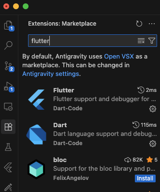
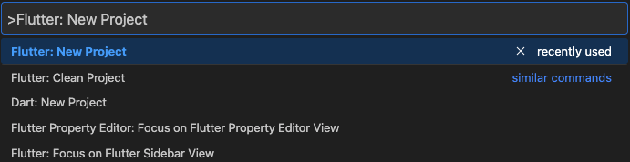
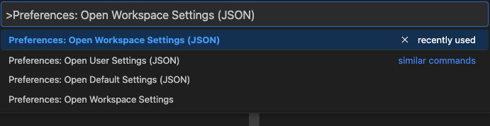
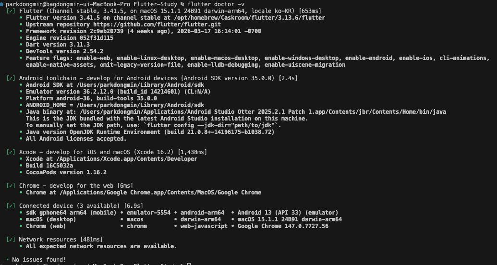

# IDE
기본적으로 Flutter 개발에는 3가지 툴이 추천된다
- Android Studio
- vscode
- Antigravity


이 중에서 Antigravity로 셋팅을 진행할 예정이니 아래 후술할 내용은 Antigravity 기준이다.

# Antigravity
## 왜 Antigravity인가?
우선 Android Studio는 1순위로 사용하지 않기로 판단했다.   

가장 큰 이유는 Extension의 부족함이었다.
Android를 개발하면서 가장 불만이었던 것은 vscode기반의 Ide 대비 Extension들이 많이 부족했다. 그로인해 FE분들이 자랑하는 Extension을 못써서 많이 샘났었는데 이 기회에 써보려고 한다.
또한 두번째 이유로는 다양한 아티클과 자료들이 vscode를 기반으로 많이 작성되어있다. 그렇기에 이제 공부를 시작하는 내 입장으로는 vscode를 사용하는 것이 더 유리하다고 판단했다.

Antigravity는 vscode의 장점을 가져오고, ide의 기본적인 역할을 수행할 뿐더러 AI의 도움을 받을 수 있다.
물론 AI는 Claude Code를 더 많이 사용할 예정이고, 거기에 더해 공부의 목적이기에 AI는 최대한 사용하지 않으려 한다.
그렇다면 vscode에 비해서 무겁기만하고 이점이 없다 생각할 수 있지만, Antigravity에 익숙해지고 추후 개발을 할 때에는 AI를 활용할 것이기에 해당 IDE로 공부를 시작하려 한다.

## Extension 설치
좌측의 Extension 탭을 눌러 Flutter를 검색하면 나오는 `Flutter`와 `Dart` Extension을 다운받아 준다. 



## Flutter Project 생성
cmd + shift + p 커맨드를 눌러주면 커맨드 팔레트가 열린다. 
`Flutter: New Project`를 작성해주면 새로운 프로젝트를 만들 수 있다.



## terminal 단축키
cmd + j 를 눌러주면 하단에 터미널이 나타난다.   
여기서 다양한 명령어를 사용해주면 된다.


## FVM 설정
[VersionManagement](../version-management/VersionManagement.md)에서 설정한 FVM을 우리 프로젝트에 적용해줘야 한다.   
cmd + shift + p 커맨드를 눌러주면 커맨드 팔레트가 열린다.    
해당 팔라트에서 아래와 같은 명령어로 검색해준다.


`Preferences: Open Workspace Settings (JSON)`



이후 fvm의 경로를 설정하고, 검색 파일에서 fvm 관련이 검색되지 않도록 exclude 해준다.

```json
{
    "dart.flutterSdkPath": ".fvm/versions/stable",
    // fvm 폴더를 검색에서 제외
    "search.exclude": {
        "**/fvm": true
    },
    // fvm 폴더를 파일 감시에서 제외
    "files.watcherExclude": {
        "**/.fvm": true
    }
}
```

## Flutter 세팅이 잘 끝났나요?
```bash
flutter doctor -v
```
이 명령어를 통해 설정이 잘 되어있는지 확인하고 프로젝트를 실행해보자.
모든 사항이 체크되어있고, `No issue found!`로 끝난다면 성공이다.


